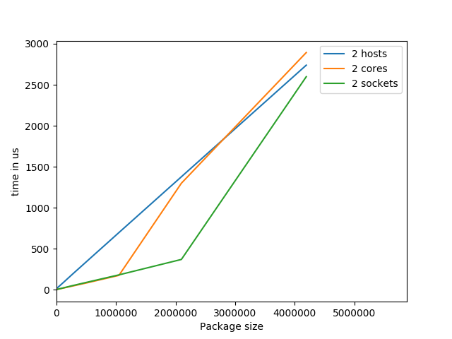
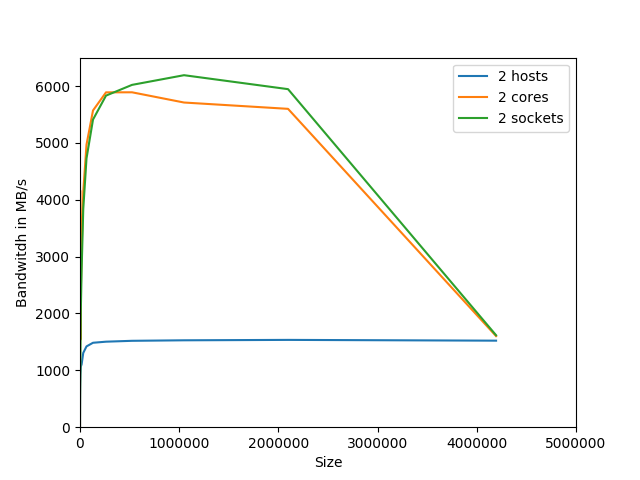

# Exercise 1


## Study how to submit jobs in SGE, how to check their state and how to cancel them.

### Submit jobs: 
1. Write SGE job script
2. Submit job ```qsub name_of_script```

### Check the state
```qstat```

### Cancel
```qdel job_id_list```


## Prepare a submission script that starts an arbitrary executable, e.g. /bin/hostname
```
#!/bin/bash

# Execute job in the queue "std.q" unless you have special requirements.
#$ -q std.q

# The batch system should use the current directory as working directory.
#$ -cwd

# Name your job. Unless you use the -o and -e options, output will
# go to a unique file name.ojob_id for each job.
#$ -N my_test_job

# Redirect output stream to this file.
#$ -o output.dat

# Join the error stream to the output stream.
#$ -j yes

#$ -pe openmpi-2perhost 8

/bin/hostname
```

## In your opionion, what are the 5 most important parameters available when submitting a job and why? 
What are possible settings of these parameters, and what effect do they have?

1. ```-q queuename```: Selects the queue where the job will be inserted. (Defines things like, max. execution hours, number of cpu slot, memory requieremnts, ...)
* ```std.q```: This is the default. General purpose queue. Default/maximum runtime: 240 hours.
* ```short.q```: or small test jobs. Limited number of CPU slots. Default/maximum runtime: 10 hours.
* ```bigmem.q```: Leo3e only. Jobs with high main memory requirements. Will run on the nodes equipped with 512GB of memory. Default/maximum runtime: 240 hours.

**Why**: Basic configurations needed for the SGE to select right queue necessery for the job.

2. ```-cwd```: execute job in current working directory. If you omit this option, you job will execute in $HOME, which is usually a bad idea. Input/output file names are relative to this directory.

**Why**: Basic configurations needed to define correct working directory.

3. ```-t 1-n```: Trivial parallelisation using a job array. Start n independent instances of your job (e.g. for extensive parameter studies). When the job is run, you use the environment variable $SGE_TASK_ID, which is set to a unique integer value from 1 .. n, to distinguish between the individual job instances (e.g. to initialize a random number generator, select an input file or compute parameter values).

**Why**: Simple way to call a programm with different settings e.g. see how parameters will affect the result or performance.


4. ```-pe parallel-environment number-of-slots```: If you run parallelized programs (MPI or shared memory), you need to specify a parallel environment and the number of processes/threads (= SGE slots) on which your parallel (MPI/OpenMP) application should run. By selecting a parallel environment you can also control how jobs are distributed across nodes.
parallel-environment:
* openmpi-1perhost
* openmpi-2perhost
* openmpi-4perhost
* openmpi-8perhost

number-of-slots: Number of hosts

**Why**: Basic configuration needed to define how much computational power we need or want to work with.

5. ```qsh -now n [...]```: The submission of interactive jobs is useful in situations where a job requires some sort of direct intervention. This is usually the case for X-Windows applications or in situations in which further processing depends on your interpretation of immediate results. A typical example for both of these cases is a graphical debugging session.

**Why**: Sometimes its necessary e.g. to debug.


## How do you run your program in parallel? What environment setup is required?
1. Write execution script.
2. Load within the script openmpi with ```module load openmpi/4.0.1``` (sets up the openmpi environment)
3. Execute programm with ```mpiexec -n 8 COMMAND```
4. Submit job with qsub JOBNAME 

# Exercise 2

## Compile micro benchmarks:
```
module load openmpi/4.0.1
./configure CC=mpicc CXX=mpic++
make
```


## How can you verify rank placement without looking at performance?

With the mpiexec flag ```--map-by ppr:N:resource``` one can define exactly how to place ranks.
ppr = "processes per resource". 
ppr:N:resource
- N: assign N processes to each resource of type resource available on the host 
- resource:	Supported options include slot, hwthread, core, L1cache, L2cache, L3cache, socket, numa, board, node, sequential, distance, and ppr.

With the mpiexec flags ```--display-map``` and ```--display-allocation``` you can verify the rank placements

E.g.

### Same host, different sockets
```
 ======================   ALLOCATED NODES   ======================

n001: flags=0x11 slots=2 max_slots=0 slots_inuse=0 state=UP
=================================================================
 Data for JOB [11610,1] offset 0 Total slots allocated 2

 ========================   JOB MAP   ========================

 Data for node: n001    Num slots: 2    Max slots: 0    Num procs: 2
     Process OMPI jobid: [11610,1] App: 0 Process rank: 0 Bound: socket 0[core 0[hwt 0]]:[B/././.][./././.]
     Process OMPI jobid: [11610,1] App: 0 Process rank: 1 Bound: socket 1[core 4[hwt 0]]./././.][B/././.]
```

###  Same Socket different cores
```
n001: flags=0x11 slots=2 max_slots=0 slots_inuse=0 state=UP
=================================================================
 Data for JOB [6730,1] offset 0 Total slots allocated 2

 ========================   JOB MAP   ========================

 Data for node: n001    Num slots: 2    Max slots: 0    Num procs: 2
     Process OMPI jobid: [6730,1] App: 0 Process rank: 0 Bound: socket 0[core 0[hwt 0]]:[B/././.][./././.]
     Process OMPI jobid: [6730,1] App: 0 Process rank: 1 Bound: socket 0[core 1[hwt 0]]./B/./.][./././.]
```

## osu_latency

### Script
```
#!/bin/bash

# Execute job in the queue "std.q" unless you have special requirements.
#$ -q std.q

# The batch system should use the current directory as working directory.
#$ -cwd

# Name your job. Unless you use the -o and -e options, output will
# go to a unique file name.ojob_id for each job.
#$ -N my_test_job

# Redirect output stream to this file.
#$ -o output.dat

# Join the error stream to the output stream.
#$ -j yes

#$ -pe openmpi-1perhost 2

module load openmpi/4.0.1
mpiexec  ./osu_latency
```

### Table

Executed on two different hosts with 1 core

| Size  |        Latency (us) |
| -------- | --------- |
| 0       |                3.48 |
| 1       |                3.55 |
| 2       |                3.55 |
| 4       |                3.55 |
| 8       |                3.61 |
| 16      |                3.64 |
| 32      |                3.67 |
| 64      |                3.84 |
| 128     |                4.84 |
| 256     |                5.34 |
| 512     |                6.11 |
| 1024    |                7.36 |
| 2048    |                9.85 |
| 4096    |               12.54 |
| 8192    |               18.52 |
| 16384   |               26.23 |
| 32768   |               36.73 |
| 65536   |               57.69 |
| 131072  |              100.54 |
| 262144  |              187.25 |
| 524288  |              358.13 |
| 1048576 |              699.15 |
| 2097152 |             1379.14 |

### Results

TODO


## osu_bw

### Scripts
```
#!/bin/bash

# Execute job in the queue "std.q" unless you have special requirements.
#$ -q std.q

# The batch system should use the current directory as working directory.
#$ -cwd

# Name your job. Unless you use the -o and -e options, output will
# go to a unique file name.ojob_id for each job.
#$ -N my_test_job

# Redirect output stream to this file.
#$ -o output.dat

# Join the error stream to the output stream.
#$ -j yes

#$ -pe openmpi-1perhost 2

module load openmpi/4.0.1
mpiexec  ./osu_bw
```

### Table

Executed on two different hosts with 1 core

| Size |     Bandwidth (MB/s) |
| -------- | --------- |
| 1          |              0.63 |
| 2          |             1.27 |
| 4          |             2.55 |
| 8          |             5.11 |
| 16         |            10.25 |
| 32         |            20.50 |
| 64         |            40.64 |
| 128        |            76.99 |
| 256        |           155.06 |
| 512        |           289.16 |
| 1024       |           535.02 |
| 2048       |           752.76 |
| 4096       |           925.47 |
| 8192       |          1064.18 |
| 16384      |          1106.46 |
| 32768      |          1305.53 |
| 65536      |          1422.83 |
| 131072     |          1483.06 |
| 262144     |          1501.27 |
| 524288     |          1518.66 |
| 1048576    |          1528.19 |
| 2097152    |          1525.28 |
| 4194304    |          1530.54 |


### Results

TODO


## How stable are the measurements when running the experiments multiple times?
TODO

