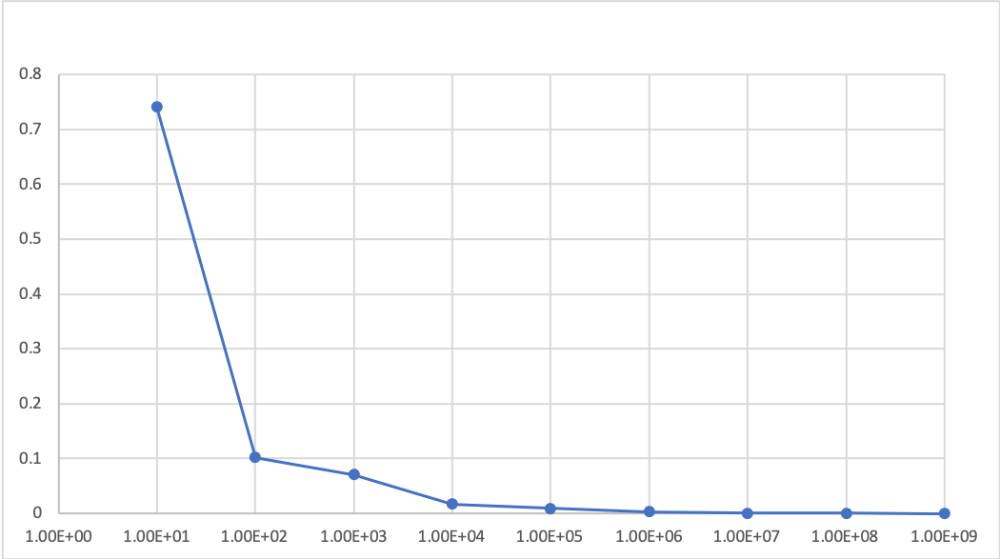
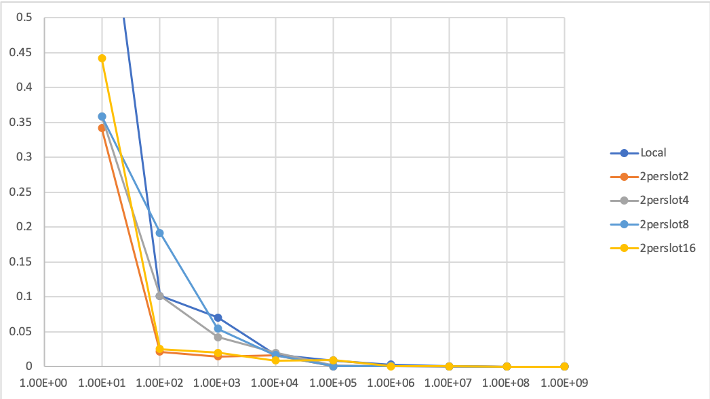

# PS 2

## Task1 

#### Write a sequential application pi_seq in C or C++ that computes π for a given number of samples (command line argument). Test your application for various, large sample sizes to verify the correctness of your implementation.

| Samples | Result
|---|---|
|10 |2.40000|
|100 |3.04000|
|1000 |3.21200|
|10000 |3.15840|
|100000 |3.15040|
|1000000 |3.14464|
|10000000 |3.14209|
|100000000 |3.14150|
|1000000000 | 3.14159|

#### Consider a parallelization strategy using MPI. Which communication pattern(s) would you choose and why?
We split up the number of samples by the number of slots. Then each slot can compute a part of the problem on its own.
After each slot has computed its number of samples, it will send `(slotNumber != 0)` or recieve `(slotNumber == 0)` the result. 
The slot with `slotNumber == 0`, will then finally artihemtic average of all results.

##### Used mpi calls:
- `MPI_Init`: Initialize mpi
- `MPI_Comm_size`: Get the number of slots
- `MPI_Comm_rank`: Get the own slot number 
- `MPI_Recv`: Sync blocking recieve
- `MPI_Send`: Sync blocking send
- `MPI_Finalize`: Clean up mpi 

#### Implement your chosen parallelization strategy as a second application pi_mpi. Run it with varying numbers of ranks and sample sizes and verify its correctness by comparing the output to pi_seq.

#### Discuss the effects and implications of your parallelization.

- t0 = Time needed for one slot to compute

Since we can simply split up the work and can compute independently we get speedup of t0/(t0/slotsCount) to calculate the partly solutions. 
Only the overhead of sending the final results from each slots `(slotNumber != 0)` to the slit `(slotNumber == 0)` adds some overhead which can be negelected if the problemSize >> slotsCount.

