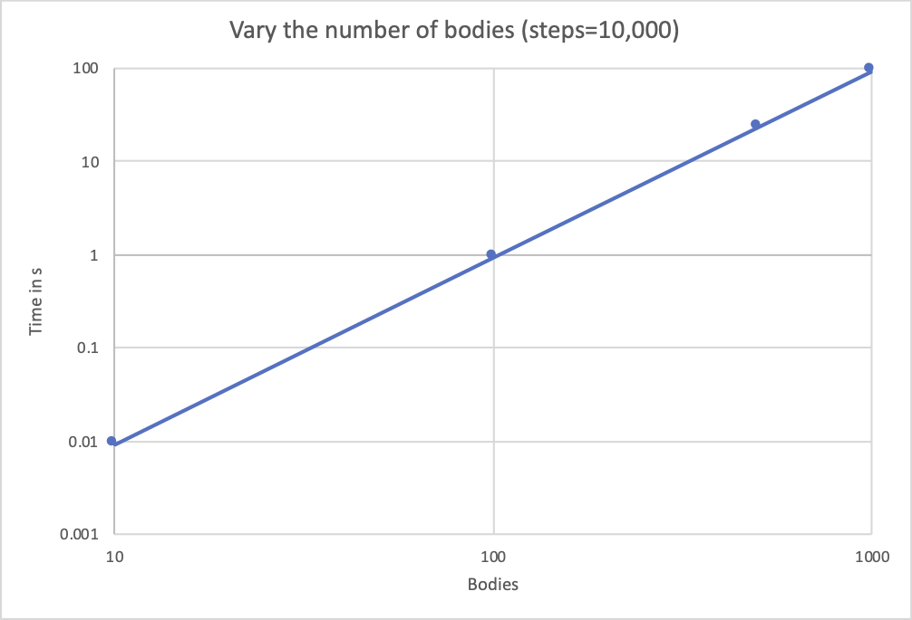
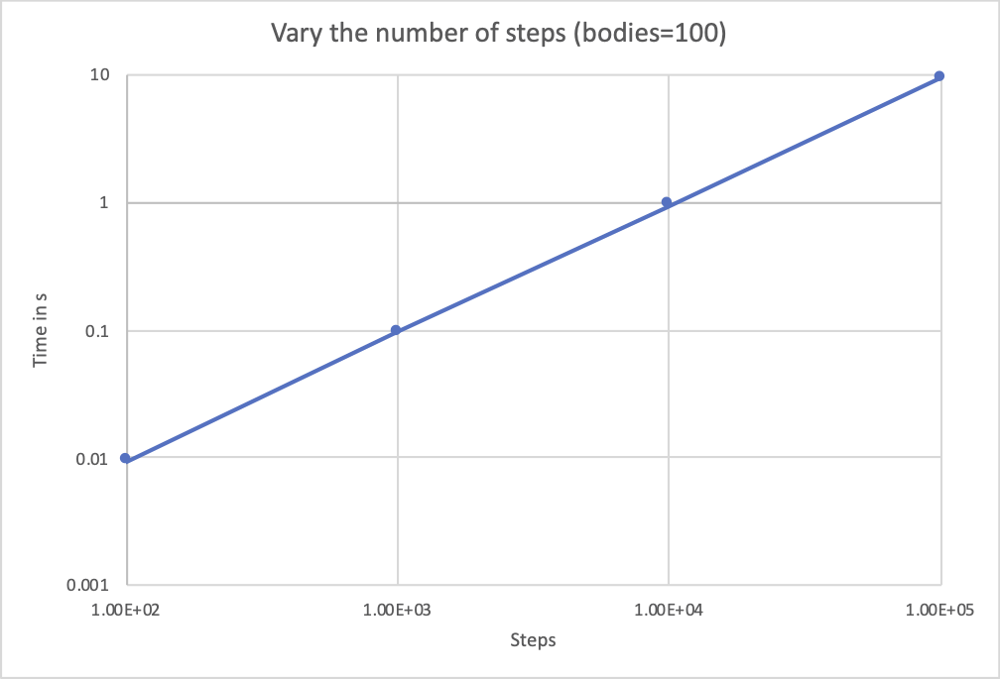

# Exercise 1

## Measure the execution time for various problem sizes. What can you observe?

For varying number of bodies, as well as varying number of steps we have a linear dependency between the problem size and the execution time. 

# Exercise 2

## What optimization methods can you come up with in order to improve the performance of Exercise 1?
- We could parallize the process (computation of bodies can be spilt up to multiple cores)

## What parallelization strategies would you consider for Exercise 1 and why?
- Split up the space into multiple cells. Each node calulates the body if its center is inside of its responsible field.
- A node is responsible for n bodies to calculate